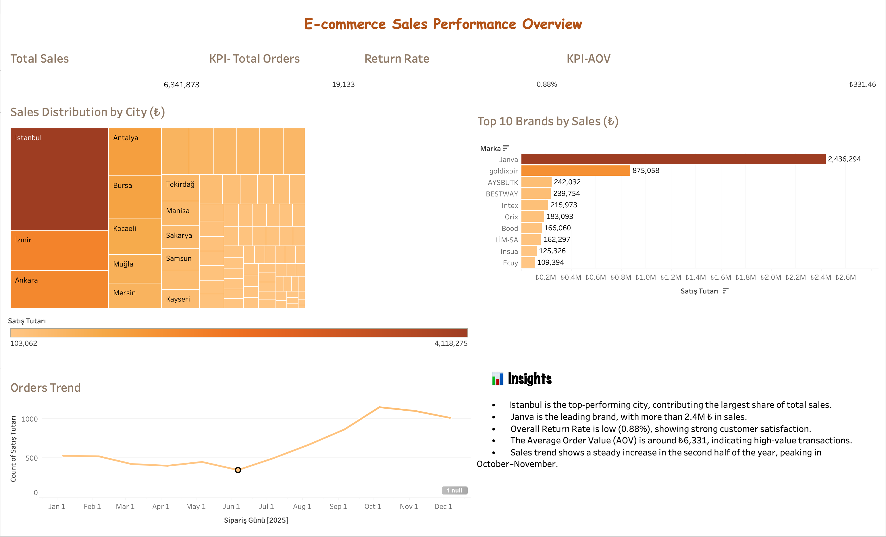

# 🛒 E-commerce Sales Dashboard

This project analyzes e-commerce sales data using **SQL** and visualizes insights with **Tableau**.  
It provides a full sales performance overview, including KPIs, sales trends, top brands, and customer distribution by city.

---

## 📊 Dashboard Link
👉 [View Dashboard on Tableau Public](https://public.tableau.com/app/profile/sultan.asrag.guzel/viz/E-commerceSalesPerformanceOverview/Dashboard1)

---

## ⚙️ Project Workflow
1. **Data Preparation**:  
   - Cleaned and structured raw sales data  
   - Wrote SQL queries for KPIs and aggregations  

2. **Analysis**:  
   - Calculated key metrics (Total Sales, Orders, AOV, Return Rate)  
   - Identified sales distribution across brands and cities  

3. **Visualization (Tableau)**:  
   - Built interactive dashboard with KPIs, trend charts, and treemap visualizations  
   - Highlighted insights with clear storytelling  

---

## 🗂️ Files in this Repository
- `SQL/` → contains SQL queries used for analysis  
- `README.md` → project documentation  

---

## 🚀 Insights
- **Istanbul** is the top-performing city, contributing the largest share of total sales.  
- **Janva** is the leading brand, with more than 2.4M ₺ in sales.  
- The overall **Return Rate** is low (0.88%), showing strong customer satisfaction.  
- The **Average Order Value (AOV)** is around ₺6,331, indicating high-value transactions.  
- Sales trend shows a steady increase in the second half of the year, peaking in **October–November**.  

---

✍️ Created by **Sultan Asrag Guzel**
